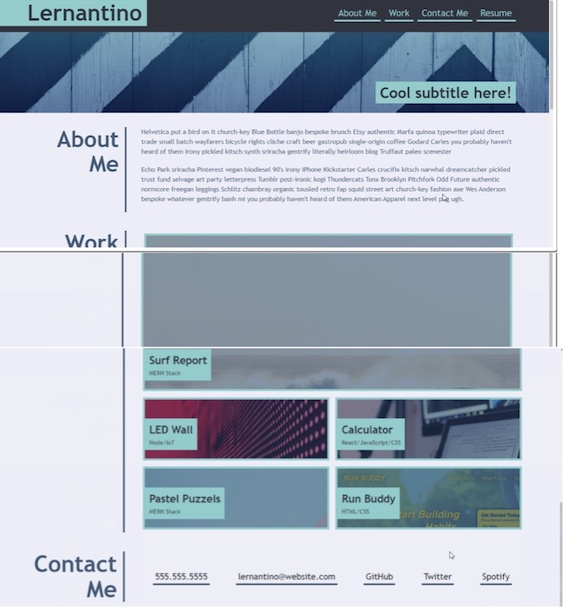

# flea-box-folio

## Description 📜
Module 2 asks us to create a portfolio website from scratch, using a responsive layout with HTML and CSS using flex-box. 

## Motivation 💪🏻
This project was created to use advanced CSS skills alongside HTML. The objective was to build a portfolio website from scratch. The folio should scroll to each section when required after clicking the navigation links. 

## Build status 🏗
* The starter code has been built from scratch by Adela Kobic (Coding Student). 
* Code will need to be refactored at a later date to check for bugs, further adjustments and adding in proper links to the dummy ones.

## Code style 🔐
* Standard HTML and CSS has been used for this project. 
The language for the website is written in US English. (USA English)

## Acceptance Criteria ✅
* The developers name, recent photo or avatar, and links to sections about them, their work and how to contact them should be displayed on the website.
* When clicking on the links in the navigation bar the User Interface scrolls to the corresponding section.
* When clicking on the section about the develoers work the UI scrolls to a section with titles images of the developers applications.
* The first application should be larger in size than the others displayed.
* When you click on the images of the applications you are taken to that deployed application.
* When you resize the page or view the site on various screens a responsive layout adapts to the viewport. 

## Assets 📷
This finished website should resemble the layout as shown in this image (images and titles may differ.)

Actual preview of Flea Box Folio. 

## Problems encountered 🤯
* geting the navigation bar to sit horizontally below the header 'Flea Box Folio'
* creating buttons that link to each section of the page - PARTLY FIXED - links created 9 July 2022, but the scrolling down hasnt worked for all of the links.
* ensuring the UI buttons scroll down to the relevant section of the page - FIXED 9 July 2022, but the Work and Contact 'scroll down' button doesn't work as it should. 
* geting the aside bar to sit alongside the body of the text and images even after using 'aside' tags  - TEMPORARILY FIXED 8 July 2022 by placing the aside tags in beween each section but they do not sit comfortably. 
* making the first image larger than all the others - issues with the grid/ flex-box - so the command (transform: scale 1,2) did not work successfully.

## Changes made to the code 𝌡
* the initial code has been created by Adela Kobic
* changes to the CSS and HTML have been made to ensure 'aside' sits comfortably, and that the scroll links to sections are in place. 

## Credits 💃🏻
* Picture credits as follows: 
    * Pikisuperstar. (2022, July 6) Freepik.com. <a href="https://www.freepik.com/vectors/abstract-mountain">Abstract mountain vector created by pikisuperstar - www.freepik.com</a>
    (mountain picture) 
    * Killian, G. (2022, July 6). Freepik.com. <a href="https://www.freepik.com/vectors/paper-layer">Paper layer vector created by GarryKillian - www.freepik.com</a>      
    (folio desert image)
    * Pikisuperstar. (2022, July 6) Freepik.com. <a href="https://www.freepik.com/vectors/creative-graphics">Creative graphics vector created by pikisuperstar - www.freepik.com</a> 
    (Japanese style graphic)
    * Kdekiara. (2022, July 6) Freepik.com. <a href="https://www.freepik.com/photos/sea-texture">Sea texture photo created by kdekiara - www.freepik.com</a>    
    (folio image sea)
    * Svstudio. (2022, July 6) Freepik.com. <a href="https://www.freepik.com/free-vector/japanese-wave-line-art-landscape-background-abstract-mountain-banner-design-pattern-vector-geometric-poster_23190973.htm">Japanese wave line art landscape background. Abstract mountain banner design pattern. Vector geometric poster</a>

## Licence 🪪
* MIT licence 
* All work has been created by Adela Kobic 